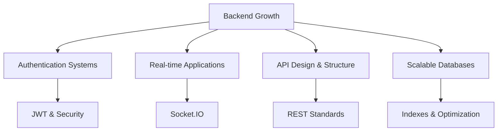

# 👋 Welcome to My Digital Space!

<div align="center">
  
</div>

---

## 🌟 About Me

<table>
  <tr>
    <td>

```javascript
const archit = {
  name: "Archit Pandey",
  role: "MERN Stack Intern (Backend-focused)",
  location: "India 🇮🇳",
  currentFocus: "Backend Engineering with MERN",
  strengths: [
    "REST API Design",
    "Authentication & Authorization",
    "Real-time Systems",
    "Database Modeling"
  ],
  technologies: {
    backend: ["Node.js", "Express.js", "MongoDB", "JWT", "Socket.IO"],
    frontend: ["React", "Redux Toolkit", "Tailwind CSS"],
    tools: ["Git", "Postman", "VS Code", "Vercel"],
    learning: ["TypeScript", "Next.js", "Docker"]
  },
  mindset: "Learn deeply, build real, avoid shortcuts",
  funFact: "I enjoy debugging backend issues more than designing UI 😄"
};
````

  </td>
  <td>
    
  </td>
</tr>
</table>

---

## 🚀 Featured Projects

### 🔹 Cognify – Real-Time AI Chat with Memory

**Live:** [https://cognify-taupe.vercel.app](https://cognify-taupe.vercel.app)
**Repo:** [https://github.com/archit7-gif/Cognify](https://github.com/archit7-gif/Cognify)

* Built a real-time chat system using **Socket.IO**
* Implemented **JWT authentication with httpOnly cookies**
* Designed persistent AI memory using **Pinecone vector database**
* Integrated **Google Gemini embeddings** for contextual responses
* Ensured data consistency across MongoDB and Pinecone
* Modular backend architecture with scalable routes

**Tech:** Node.js, Express, MongoDB, Socket.IO, Pinecone, Gemini API

---

### 🔹 Job-Scribe – AI Resume Analysis & Job Tracker

**Live:** [https://job-scribe-neon.vercel.app](https://job-scribe-neon.vercel.app)
**Repo:** [https://github.com/archit7-gif/JOB-SCRIBE](https://github.com/archit7-gif/JOB-SCRIBE)

* Developed REST APIs for resumes and job applications
* Secure authentication using **JWT + bcrypt**
* Implemented **AI resume analysis with caching**
* Designed CRUD flows for application tracking
* Structured backend logic for scalability and performance

**Tech:** Node.js, Express, MongoDB, JWT, AI API

---

## 🧠 Skills

### 🔧 Backend & Databases


### 💻 Frontend (Supportive)


### 🛠️ Tools


---

## 🎯 Current Focus



---

## 🎓 Training & Learning

| 📘 Program       | 🏫 Platform             | 🎯 Focus                         |
| ---------------- | ----------------------- | -------------------------------- |
| Job Ready Cohort | Sheryians Coding School | Hands-on MERN + Backend Projects |

---

## 📊 GitHub Analytics

<div align="center">
  
  
</div>

---

## 🎯 2025 Goals

* [ ] Secure a **Backend-focused MERN Internship**
* [ ] Strengthen system design fundamentals
* [ ] Learn TypeScript deeply
* [ ] Add Docker & deployment workflows
* [ ] Build 2 more backend-heavy projects

---

## 🌐 Connect With Me

<div align="center">

[](https://www.linkedin.com/in/archit-pandey-580069349/)
[](https://architpandey.vercel.app)
[](https://github.com/archit7-gif)

</div>

---

<div align="center">
  
  <p><em>Focused on building real backend systems, not just pretty UIs.</em></p>
</div>
```


