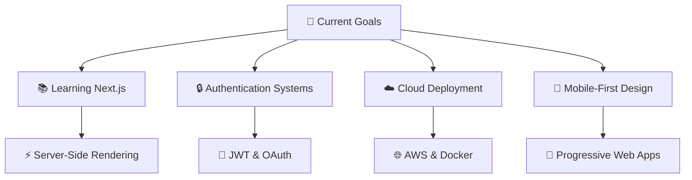

# 👋 Welcome to My Digital Universe!

<div align="center">
  
</div>

---

## 🌟 About Me

<table>
  <tr>
    <td>
      
```javascript
const archit = {
    name: "Archit Pandey",
    role: "Frontend Developer",
    location: "India 🇮🇳",
    currentFocus: "Full Stack Development",
    technologies: {
        frontend: ["React", "JavaScript", "Tailwind CSS", "HTML5", "CSS3"],
        backend: ["Node.js", "Express.js", "MongoDB"],
        tools: ["Git", "VS Code", "Postman", "Figma"],
        learning: ["TypeScript", "Next.js", "GraphQL", "Docker"]
    },
    passion: "Building user-centric applications",
    funFact: "I debug like Sherlock Holmes but forget semicolons like Mr. Bean! 🕵️‍♂️"
};
````

  </td>
  <td>
    
  </td>
</tr>
</table>

---

## 💻 Frontend Development

<div align="center">


</div>

---

## 🔧 Backend & Database

<div align="center">


</div>

---

## 🛠️ Tools & Platforms

<div align="center">


</div>

---

## 🏆 Featured Projects

<table align="center">
<tr>
<th>🎯 Project</th>
<th>💻 Tech Stack</th>
<th>🌐 Live Demo</th>
<th>📝 Description</th>
</tr>
<tr>
<td>🌟 Portfolio Website</td>
<td>React, Tailwind CSS, Framer Motion</td>
<td>[View Live](https://architpandey.vercel.app)</td>
<td>Modern, responsive portfolio with smooth animations</td>
</tr>
<tr>
<td>✅ TaskMate Pro</td>
<td>React, Context API, LocalStorage</td>
<td>Coming Soon</td>
<td>Advanced todo app with themes, categories & analytics</td>
</tr>
<tr>
<td>📝 Notes API</td>
<td>Node.js, Express, MongoDB</td>
<td>[GitHub](https://github.com/architpandey)</td>
<td>RESTful API with authentication & CRUD operations</td>
</tr>
<tr>
<td>🎨 Color Palette Generator</td>
<td>Vanilla JS, CSS3</td>
<td>Coming Soon</td>
<td>Generate beautiful color schemes for designers</td>
</tr>
<tr>
<td>🛒 E-Commerce Dashboard</td>
<td>React, Chart.js, Mock API</td>
<td>Coming Soon</td>
<td>Admin panel with data visualization</td>
</tr>
</table>

---

## 📊 GitHub Analytics

<div align="center">
  
  
</div>

<div align="center">
  
</div>

<div align="center">
  
</div>

---

## 🎯 Current Focus



---

## 🏅 Achievements & Certifications

<div align="center">

| 🏆 Achievement         | 📅 Date | 🎯 Details                            |
| ---------------------- | ------- | ------------------------------------- |
| 🌟 100 Days of Code    | 2024    | Consistent coding streak              |
| ⚛️ React Certification | 2024    | Advanced React concepts               |
| 🎨 Frontend Mentor     | 2024    | Multiple challenge completions        |
| 🧊 Arctic Code Vault   | 2023    | Contributor to preserved repositories |

</div>

---

## 📈 Coding Activity

<div align="center">
  
</div>

<div align="center">
  
  
</div>

---

## 🌐 Connect With Me

<div align="center">

[](mailto:architpandey@example.com)
[](https://www.linkedin.com/in/architpandey)
[](https://architpandey.vercel.app)
[](https://twitter.com/architpandey)
[](https://instagram.com/architpandey)

</div>

---

## 💭 Developer Quotes

<div align="center">

> *"First, solve the problem. Then, write the code."* — **John Johnson**
> *"Code is like humor. When you have to explain it, it's bad."* — **Cory House**
> *"The best error message is the one that never shows up."* — **Thomas Fuchs**

</div>

---

## 🐍 Contribution Snake

<div align="center">
  
</div>

---

## 🎵 Spotify Playing

<div align="center">
  
</div>

---

## 📊 Weekly Development Breakdown

```text
JavaScript   12 hrs 30 mins  ████████████████░░░░░   65.2%
React        4 hrs 15 mins   ████████░░░░░░░░░░░░░   22.1%
CSS          1 hr 45 mins    ███░░░░░░░░░░░░░░░░░░   9.1%
HTML         30 mins         ██░░░░░░░░░░░░░░░░░░░   2.6%
Other        12 mins         █░░░░░░░░░░░░░░░░░░░░   1.0%
```

---

## 🎯 2025 Goals

* [ ] 🚀 Master Next.js and TypeScript
* [ ] 🌱 Contribute to 5 open-source projects
* [ ] 📱 Build and deploy 3 full-stack applications
* [ ] 📝 Write 12 technical blog posts
* [ ] 🏆 Earn 3 new certifications
* [ ] 🤝 Mentor 2 junior developers
* [ ] ☁️ Learn cloud platforms (AWS/GCP)

---

## 🏆 GitHub Trophies

<div align="center">
  
</div>

---

## 📈 Profile Views

<div align="center">
  
</div>

---

<div align="center">
  
  <br />
  <h3>⭐ From <a href="https://github.com/architpandey">Archit Pandey</a> with 💙</h3>
  <p><em>"Building the future, one commit at a time"</em> 🚀</p>
</div>
```


