# 👋 Hi, I’m Archit Pandey

<div align="center">
  
</div>

---

## 🧭 About Me

I’m a MERN stack developer who builds production-ready web applications end-to-end. From architecting REST APIs and databases to implementing authentication, real-time features, and responsive UIs, I focus on creating fast, reliable, and maintainable solutions.

I’m currently seeking an internship where I can work on real-world products, collaborate with experienced engineers, and grow into a stronger full-stack developer while delivering real value to the team.


---

```js
const archit = {
  stack: "MERN",
  focus: "Backend-driven full-stack development",
  strengths: ["API design", "Auth systems", "Database modeling", "Realtime communication"],
  mindset: "Learn deeply, build practically, improve continuously"
};
````

---

## 🚀 Featured Projects

### 🔹 Cognify — Real-Time AI Chat with Memory

**Live:** [https://cognify-taupe.vercel.app](https://cognify-taupe.vercel.app)
<Br/>
**Repo:** [https://github.com/archit7-gif/Cognify](https://github.com/archit7-gif/Cognify)

**What it does**
Cognify is a real-time chat application that combines instant messaging with persistent AI memory, allowing conversations to remain contextual across sessions.

**Key implementations**

* Real-time bi-directional messaging using **Socket.IO**
* Secure authentication using **JWT with httpOnly cookies**
* Chat and user data stored in **MongoDB**
* Message embeddings generated using **Google Gemini**
* Semantic memory stored and queried via **Pinecone**
* Synchronized deletion between MongoDB and Pinecone for data consistency

**Tech Stack**
Node.js · Express.js · MongoDB · Socket.IO · Pinecone · Google Gemini · React · Redux Toolkit

---

### 🔹 Job-Scribe — AI Resume Analyzer & Job Tracker

**Live:** [https://job-scribe-neon.vercel.app](https://job-scribe-neon.vercel.app)
<Br/>
**Repo:** [https://github.com/archit7-gif/JOB-SCRIBE](https://github.com/archit7-gif/JOB-SCRIBE)

**What it does**
Job-Scribe helps users analyze resumes against job descriptions and manage job applications from a single dashboard.

**Key implementations**

* RESTful APIs for resumes, applications, and notes
* **JWT + bcrypt** based authentication and protected routes
* AI-powered resume analysis with keyword extraction
* Caching to reduce repeated AI API calls
* Structured CRUD operations with validation
* End-to-end frontend–backend integration

**Tech Stack**
Node.js · Express.js · MongoDB · JWT · React · Redux Toolkit · AI API integration

---

## 🛠️ Technical Skills

### Backend & Data

* Node.js (async flows, middleware, error handling)
* Express.js (REST APIs, routing patterns)
* MongoDB & Mongoose (schema design, queries)
* Authentication (JWT, cookies, bcrypt)
* Real-time communication (Socket.IO)
* Caching & rate-limiting concepts


### Frontend
* React (functional components, hooks, component composition)
* Redux Toolkit (state slices, async actions, predictable data flow)
* Responsive UI implementation across devices
* Component structuring aligned with data flow and user interaction


### Tools & Workflow

* Git & GitHub
* Postman
* Vercel
* Render 
* Environment configuration & deployment basics

> I work across the full stack, with more time spent designing backend logic and data flow, and frontend implementation used to complete and validate real use cases.

---

## 🧩 Architecture & Practices

* Clear separation of **routes, controllers, models**
* Modular and scalable project structure
* Token-based authentication and secure cookies
* Consistent API response patterns
* Clean integration between backend services and UI

---

## 📊 GitHub Analytics

<div align="center">
  
  
</div>

<div align="center">
  
</div>

---

## 🎯 Current Focus

```mermaid
graph TD
  A[🎯 Current Focus] --> B[Backend Performance & Scalability]
  A --> C[Secure & Maintainable Auth Systems]
  A --> D[Production Deployment & DevOps Basics]
  A --> E[Data Handling & Query Optimization]

  B --> F[Redis Caching, Rate Limiting]
  C --> G[JWT Lifecycle, Refresh Tokens, Role-Based Access]
  D --> H[Docker, CI/CD Pipelines, Cloud Deployment]
  E --> I[MongoDB Aggregation Pipelines, Indexing]

```



---

## 🧠 What I Can Discuss Confidently

* Designing REST APIs and backend flows
* Authentication & authorization strategies
* MongoDB schema modeling and query patterns
* Real-time messaging systems
* Trade-offs between performance, simplicity, and scalability

---

## 🎯 Goals (2025)

* Secure a MERN stack internship
* Strengthen backend architecture skills
* Improve TypeScript and code reliability
* Build more production-grade full-stack systems
* Contribute to collaborative projects

---

## 🌐 Connect With Me

<div align="center">
  [](https://github.com/archit7-gif)
  [](https://www.linkedin.com/in/archit-pandey-580069349/)
  [](https://x.com/ArchitP8296053)
  [](mailto:your-email@gmail.com)
</div>
>


---

<div align="center">
  
  <br/>
  <p><em>Building real systems — learning by shipping.</em></p>
</div>


